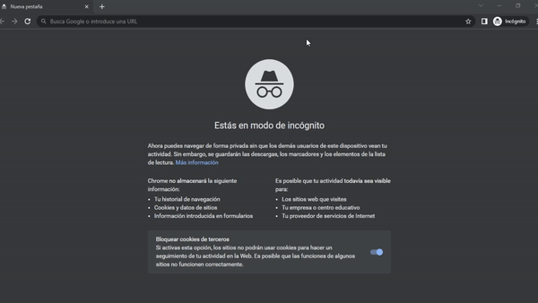
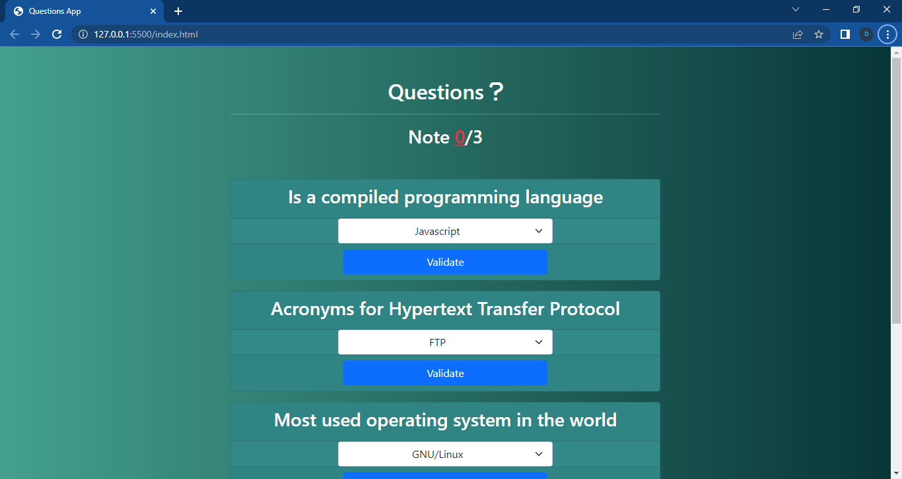

# HTML Questions App.

A small app for answer __questions from the browser__, using HTML, Javascript, Bootstrap 5 for styles and icons from Fontawesome.

# View App using Docker.
You can view the app using docker, with a no-vnc server. Using a image with Ubuntu and lxde like
desktop enviroment. And executing the app with Chrome.

The Dockerfile is in this proyect and you can build a image and run a container.


```bash
$ docker build -t questions-web-app .  # building
$ docker run -p 6080:80 ---name myapp questions-web-app # executing
```

Now you can visit this direction of the some browser like Chrome <a href="http://localhost:6080" target="_blank" rel="noreferrer">http://localhost:6080/</a>

And make this:



## Screenshot.
